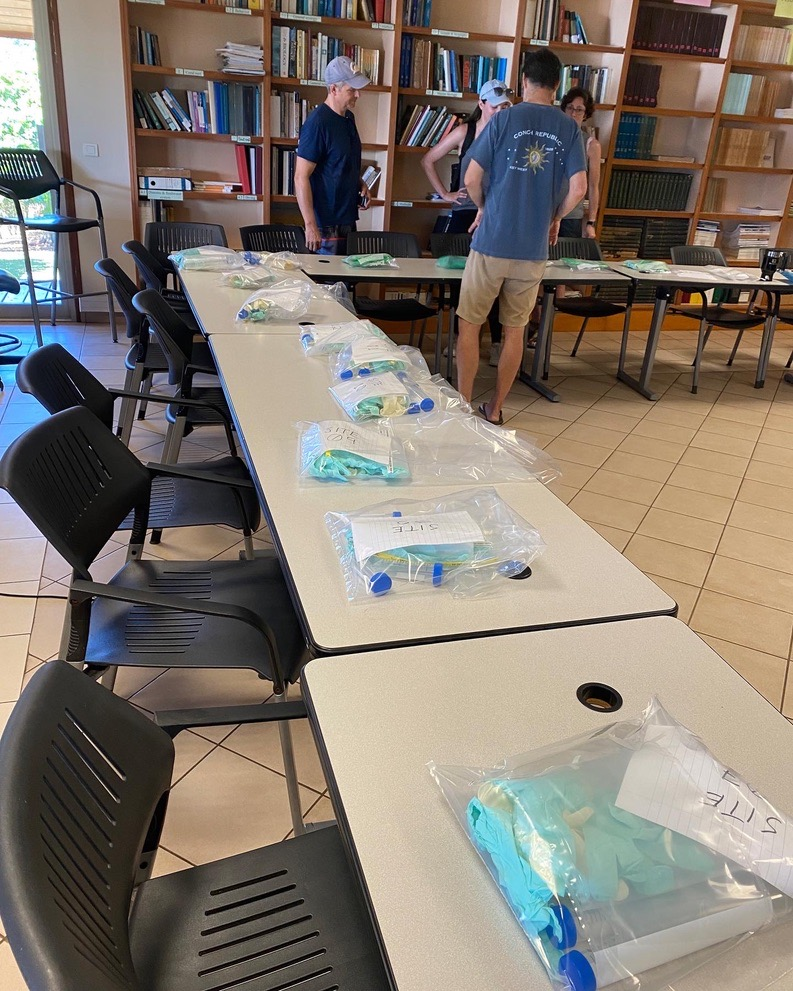
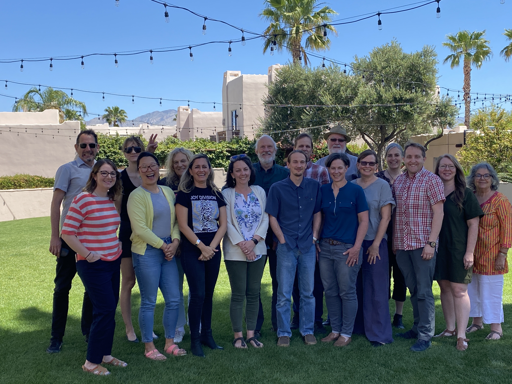
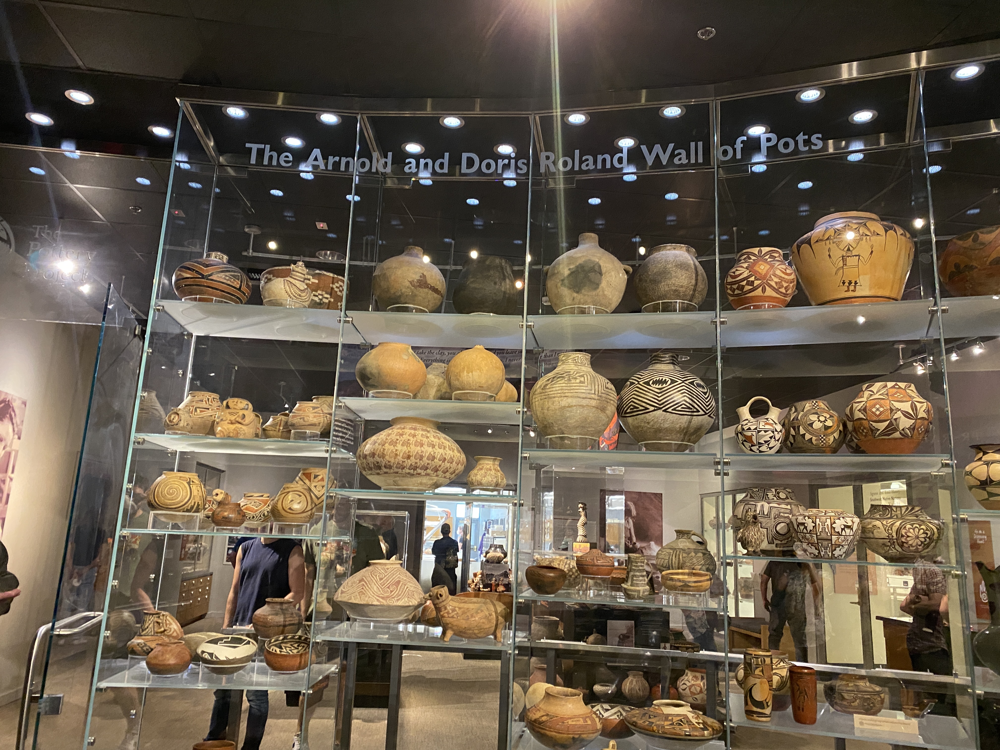
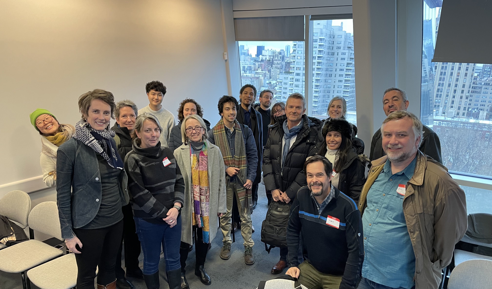
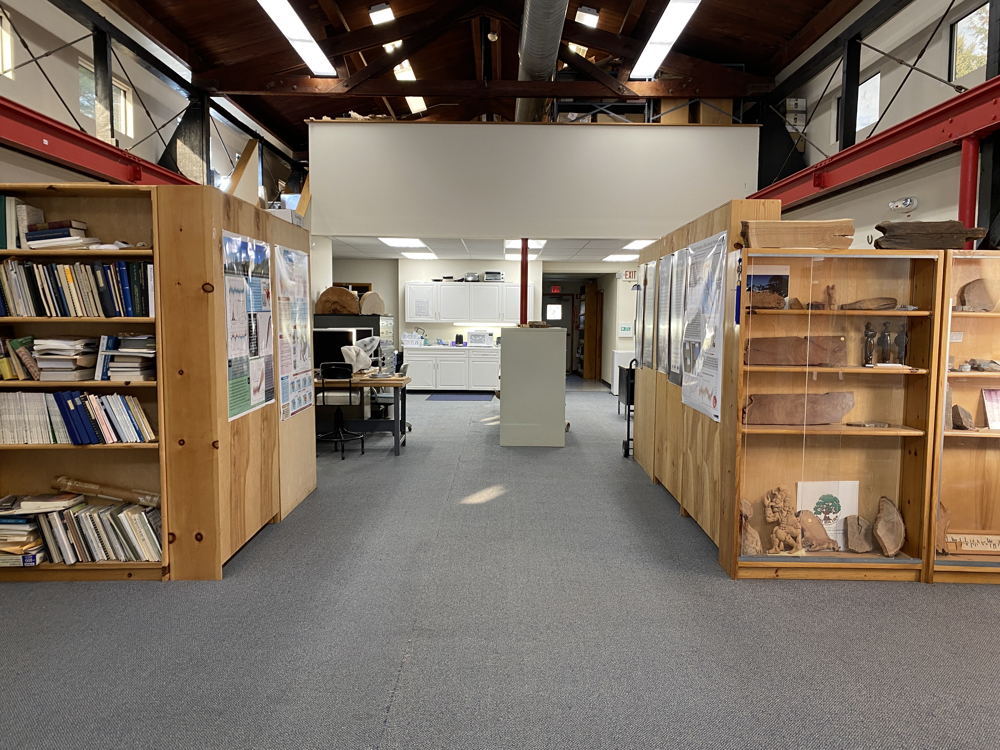
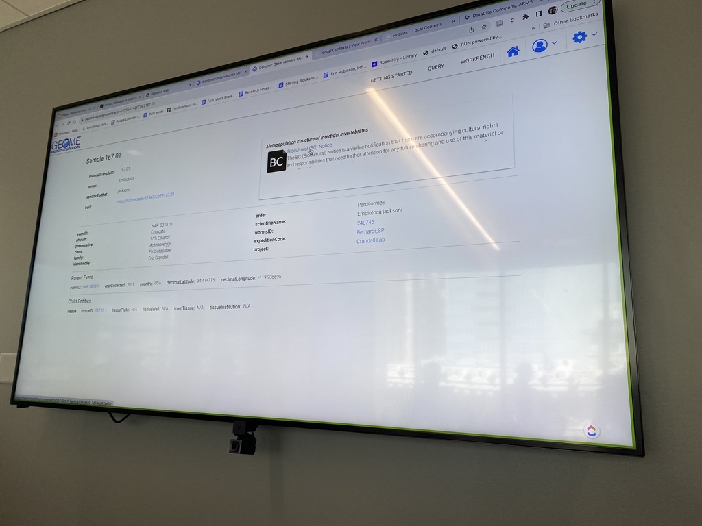

The Sampling Nature Research Coordination Network (RCN) creates connections across the natural history value chain that samples nature at field sites, labs, repositories, and museums through thematic workshops to exploit the potential of an accessible, integrated corpus of material sample data.

## Mo'orea, French Polynesia \| March 21-22, 2022

**Theme:** Water, Rivers, Coasts, and Oceans \|(Co-located with the Genomic Standards Consortium and Island Sampling Day)

**Description:** Our first workshop with the Waters theme ("Waters: Rivers, Coasts, and Oceans") was timed to coincide with the 22nd annual meeting of the Genomic Standards Consortium to take advantage of participants from the biodiversity genomics community, who would already be present at that meeting. GSC 22 was co-hosted by UC Berkeley’s Gump Station (a Coral Reef LTER Site) and the Centre for Island Research and Environmental Observatory (CRIOBE, one of France’s preeminent laboratories for the study of coral reef ecosystems). The interdisciplinary themes of GSC 22 – Biodiversity, Climate Change, and Human Health – made it an ideal venue for promoting our RCN activities. Sampling Nature co-hosted GSC’s “Island Sampling Day” – a one day, post-conference activity to collect soil, sediment, and water samples along a transect following the 'Ōpūnohu River and Bay. The sampling process will be documented in a joint GSC/Sampling Nature methods publication that describes standard practices and challenges in sample collection for interdisciplinary reuse. Sampling Nature also contributed a presentation about the RCN and the iSamples CI project at the GSC 22.

**Field Trip - Island Sampling Day**

## Tucson, Arizona \| May 8-9, 2023 

**Theme:** Food and Health

**Description:** The “Sampling Nature Workshop 2”, held in Tucson, AZ, on May 8-9, 2023, convened a diverse group of stakeholders focused on improving the management and utility of uncurated collections and developing robust metadata standards for sustainability science. This workshop aimed to address the challenges associated with long-tail collections and foster the adoption of comprehensive metadata schemas through interdisciplinary collaboration.

[**Agenda**](https://docs.google.com/document/d/1uMR7OUK5oA3qM5pLUm0YkYGkZH6wTUwVOQxxTezJqEo/edit)

**Field trip to the [Arizona State Museum](https://statemuseum.arizona.edu/)**

## New York City, NY \| December 6-7, 2023

**Theme:** Sampling Nature: Samples with Consequences Workshop - Exploring the Social, Ethical and Legal Dimensions of Samples

**Description:** The "Sampling Nature: Samples with Consequences Workshop" held in December 2023 at NYU, delved into the intricate ethical, legal, and social dimensions of sample collection, particularly within urban settings like New York City. Featuring diverse case studies such as the New York Botanical Garden, NYC Archaeological Repository, and public health biosampling, the workshop illuminated the complex interdependencies between sample collection practices and broader ethical, legal, and social implications. Discussions emphasized data sovereignty, striving for a balanced approach to managing sample collections that respects scientific inquiry and community rights.

[**Agenda**](https://docs.google.com/document/d/1WbF3RQnERkbzQvm-vNgXQ2U6jQVLRFabxbxC-OxVRd0/edit)

**Field Trip to the [NYC Archaeological Repository](https://archaeology.cityofnewyork.us/)**

## Washington, D.C. \| May 29-31, 2024 Washington, D.C

**Theme:** Sampling Nature for 'Omic Observatories in an AI World - Examining what's next for sample management

**Description:** The 4th in the Sampling Nature Workshop series was entitled "Sampling Nature for 'Omic Observatories in an AI World" and was a collaboration between Sampling Nature, iSamples, and Omic BON to explore how to reuse data and samples to improve biodiversity observations, combine them with other data types, and contribute to global models. Omic observations are tied to material samples, and tracking the metadata and context of those samples is critical to data quality and reuse.

[**Agenda**](https://docs.google.com/document/d/1uMR7OUK5oA3qM5pLUm0YkYGkZH6wTUwVOQxxTezJqEo/edit)

**Field Trip to the [Museum Support Center](https://naturalhistory.si.edu/research/msc)**

## Other Meetings

In addition to the four workshops, the team held opportunistic meetings.

### Team Planning Workshop (November 2022, New York) and Field Trip to Tree Ring Laboratory

**Description:** We co-hosted an in person workshop at Lamont Doherty Earth Institute in November 2022 with the iSamples Project. During this workshop the iSamples team gave an update on the platform development, planned next steps and spent some time identifying outreach opportunities. This led to a new collaboration between the IEDA and the Tree Ring Laboratory.

### Team Planning Workshop (September 2023, Oakland, CA)

**Description:** “The iPlaces Workshop”, hosted at the California Digital Library in Oakland, CA, brought together an interdisciplinary team from the iSamples, Sampling Nature, and FAIR Island projects to develop the framework for iPlaces — a visionary platform for place-based open science. Based on feedback and learning from the Sampling Nature RCN, this meeting focused on the sample infrastructure needs for connecting samples back to the places they originate. The meeting also focused on connecting the required legal and social documentation needed to prove ethical sampling.

### Biocode - iPlaces Workshop (March 18-22, 2024, Moorea, French Polynesia)

**Description** Part of the Sampling Nature leadership, Neil Davies and Jane Anderson, as well as Erin Robinson, organized and led the workshop in Moorea, the site of the NSF Moorea Coral Reef LTER. It built on the outcomes of the prior Sampling Nature events and included representatives of museum, ecological (LTER), genomics, and Indigenous (Polynesian) communities. The workshop developed a use case of broad interest to the Sampling Nature network (Biocode 2.0). In particular, it advanced concepts of how better to integrate social and legal aspects into sampling programs. This broadened the Biocode project into a more comprehensive program Te Ora Fenua, that will leverage the sample infrastructure of iSamples and build on the understanding gained by the Sampling Nature community in order to connect samples collected in a particular place back to the place. In particular, during the workshop, Jane Anderson supported the Polynesian community-based organization (Te Pu Atiti’a) in establishing a community on the Local Context platform that will work closely with Univ. California Gump Station to implement a cultural review of scientific projects, layering in social (and legal) metadata to their material samples.
